# Data pipeline Covid19 con AWS ECS Fargate
 

## Resumen

Data pipeline que extrae, procesa y analiza datos sobre casos de Covid19 reportados y publicados por el gobierno argentino en el sitio oficial https://datos.gob.ar/dataset/salud-covid-19-casos-registrados-republica-argentina. 

El data pipeline está organizado como una aplicación de alta disponibilidad en 3 capas - capa pública, capa de aplicación y capa de base de datos - que periódicamente extrae datos de una fuente pública, los transforma y los carga en un base PostgreSQL, dejando disponible un dashboard de análisis sobre Metabase que se utiliza como solución de reporting. 

Se implementa CI/CD con GitHub Actions para realizar el build y registro de la imágen docker del ETL en Elastic Container Registry (ECR), utilizada luego por el servicio de ECS fargate para ejecutar la tarea. 

Se utiliza Cloudformation para realizar gran parte del despliegue de la infraestructura. 

Se expone a continuación la topología de red utilizada.
    

  
 

## Descripción de la aplicación

**Capa Pública**: 

- Bastion Host: Se despliega un grupo de auto escalado con una sola instancias ec2 t2.micro utilizada como Bastion Host para poder gestionar la infraestructura. Esta solución permite conectar a la base de datos - sin acceso público - para realizar tareas de inicialización y mantenimiento. 

- Matabase: Se despliega el servicio de Metabase con un cluster ECS fargate, utilizando la RDS PostgreSQL del proyecto como backend, en lugar de la base H2 (default) que no se recomienda para ambientes productivos. El cluster ECS se implemta con Aplication Load Balancer. 

**Capa de Aplicación**:

- ETL: Se desliega otro cluster ECS fargate que ejecuta la tarea de ETL desarrollada en Python. El código del ETL está sobre un repositorio GitHub - https://github.com/jdanussi/data-pipeline-covid19-etl - conectado con el servicio de ECR por medio de GitHub Actions, que realiza el build y registro de la imagen docker cada vez que se "pushea" el main branch. 

**Capa de Base de Datos**:

- PostgreSQL: Se despliega una RDS PostgreSQL con una read replica Multi-AZ. La instancia de tipo *master* - lectura/escritura - es utilizada por el ETL para cargar los datos procesados, y por Metabase como backend de su operación. La instancia de tipo *replica* - solo lectura - es utilizada por Metabase para acceder a los datos y mostrar los dashboard previamente generados.
  

## Flujo de la aplicación

- Periodicamente con un cron schedule se invoca una función **Lambda** desde **EventBridge** que hace el download de los datasets desde la ṕagina donde se publican y los almacena en un bucket **S3**. La periodicidad dependerá de la frecuencia de actualización de los dataset. 

- La función, luego de completar el download, corre una tarea de **ECS fargate** que transforma los datos de manera conveniente y los carga en tablas de la instancia RDS master de PostgreSQL. Tanto el cluster como la definición de la tarea ya existen en ECS, la función Lambda solo los invoca y setea algunos parámetros necesarios para la corrida. 
La tarea de ETL no corre como un servicio dentro de ECS de manera permanente sino que es lanzada por la función lambda y la misma se termina una vez que completa el proceso. Por lo tanto la tarea implica un costo solo por los recursos que utiliza durante el tiempo de la corrida.

- Un dashboard con análisis de los datos queda siempre disponible sobre Metabase, desplegado por un servicio sobre ECS fargate que corre de forma permanente. Se ideo así para que la capa de reporting y analitics este disponible para este o cualquier otro proyecto de datos que se quiera desarrollar en la VPC. 
A Metabase se accede mediante el nombre ṕublico DNS del Aplication Load Balancer que hace de frontend del grupo de auto escalado del servicio ECS.  

 

## Despliegue de la infraestructura

Se despliega gran parte de la infraestructura utilizando AWS CLI con templates de Cloudformation.

A continuación se describe la secuencia de pasos a seguir dentro del ambiente de laboratorio otorgado por awsacademy.

- Actualizar credenciales AWS en el entorno local: Crear profile "cde" en `~/.aws/credentials` con las credenciales temporales otorgadas por el entorno de laboratorio.

    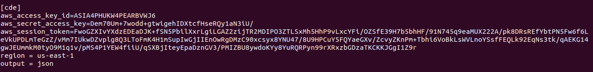  

 

- Agregar al IAM role *LabRole* la siguiente inline policy

        {
            "Version": "2012-10-17",
            "Statement": [
                {
                    "Effect": "Allow",
                    "Action": ["ssm:*"],
                    "Resource": ["*"]
                }
            ]
        }

    que permite full access al servicio de System Manager Parameter Store utilizado por la aplicación para la gestión de parámetros. 
     

    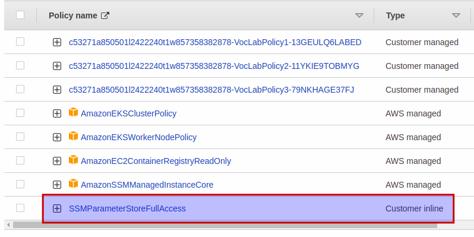 
 

- Crear el Key Pair *BastionHost* que se utilizará para acceso ssh al bastion host. Hacer el download del archivo .pem correspondiente y setear los permisos

        $> cd ~/.ssh
        $> mv ~/Downloads/BastionHost.pem .
        $> chmod 400 BastionHost.pem

 

- Parados en la carpeta root del proyecto, crear el stack *vpc-prod* utilizando el template `01-vpc.yml` 

        $> aws cloudformation create-stack \
            --stack-name vpc-prod \
            --template-body file://cfn-templates/01-vpc.yml \
            --profile cde

    El stack despliega y configura los siguientes recursos:

  - 1 VPC
  - 2 subnets públicas distribuídas en 2 zonas de disponibilidad para los servicios públicos (Public tier).
  - 2 subnets privadas distribuídas en 2 zonas de disponibilidad para alojar la corrida del ETL (Data pipeline tier).
  - 2 subnets privadas distribuídas en 2 zonas de disponibilidad para alojar la base de datos (Database tier).
  - 1 Internet Gateway para permitir el acceso a internet de las subnets públicas.
  - 3 tablas de rutas, una por cada capa. 
  - 6 VPC Endpoints.
  - 5 Security groups.
  - Personalización de los NACLs asociados a las subnets privadas para hacerlos más restrictivos.
  

- Registrar en System Manager Parameter Store los siguiente parámetros iniciales

    - /cde/POSTGRES_USER
    - /cde/POSTGRES_PASSWORD 
    - /cde/DB_DATABASE 
    - /cde/DB_USER 
    - /cde/DB_PASS 
    - /cde/S3_BUCKET_DATASETS 
    - /cde/S3_BUCKET_REPORT 
    - /cde/S3_BUCKET_LAMBDA 
    - /cde/ECS_CLUSTER 
    - /cde/ECS_TASK_DEFINITION 
      

    utilizando el script de bash `parameter_store_values_put.sh` que se encuentra en la carpeta root del proyecto: 

        $> bash parameter_store_values_put.sh

- Crear el stack *asg-prod* que despliega un grupo de auto escalado en la capa pública para el Bastion Host, utilizando el template `02-asg.yml`

        $> aws cloudformation create-stack \
            --stack-name asg-prod \
            --template-body file://cfn-templates/02-asg.yml \
            --profile cde

- Crear el stack *rds-prod* que despliega las instancias RDS master y replica en la capa de base de datos utilizando el template `03-rds.yml`

        $> aws cloudformation create-stack \
            --stack-name rds-prod \
            --template-body file://cfn-templates/03-rds.yml \
            --profile cde

    El template registra en Parameter Store los endpoints de ambas instancias.

- Crear el stack *s3-prod* que despliega los buckets S3 para almacenar los datasets fuente y la distribución de la función lambda que se creará más adelante. Se utiliza el template `04-s3.yml`

        $> aws cloudformation create-stack \
            --stack-name s3-prod \
            --template-body file://cfn-templates/04-s3.yml \
            --profile cde

- Crear el stack *ecr-prod* que despliega en ECR el repositorio *python-etl* que luego alojará la imagen docker del ETL que ejecuta la tarea ECS. Se utiliza el template `05-ecr.yml`

        $> aws cloudformation create-stack \
            --stack-name ecr-prod \
            --template-body file://cfn-templates/05-ecr.yml \
            --profile cde

- Subir a S3 el archivo .zip necesario para el deploy de la función lambda

        $> cd downloadFileToS3
        $> aws s3api put-object --bucket pipeline-covid19-lambda-functions --key downloadFileToS3 --profile cde --body ./lambda_function.zip

- Crear el stack *lambda-prod* que despliega la función lambda encargada de hacer el download de los datasets desde las fuentes, y de ejecutar la tarea ETL sobre el servicio ECS fargate. Se utiliza el template `06-lambda.yml`

        $> aws cloudformation create-stack \
            --stack-name lambda-prod \
            --template-body file://cfn-templates/06-lambda.yml \
            --capabilities CAPABILITY_NAMED_IAM \
            --capabilities CAPABILITY_AUTO_EXPAND \
            --profile cde

    Este despliegue genera el grupo de log correspondiente en Cloudwatch.

- Crear el stack *logs-prod* que despliega los grupos de log en Cloudwatch para las tareas ECS. Se utiliza el template `07-logs.yml`

        $> aws cloudformation create-stack \
            --stack-name LOGS01 \
            --template-body file://cfn-templates/07-logs.template.yaml \
            --profile cde

- Inicializar la base de datos utizando el bastion host para acceder. Para ello agregamos la Elastic Public IP (EIP) del Bastion Host en `/etc/hosts`. Ejemplo

        54.225.211.158 bastionlab

    Hacemos el ssh forwarding para que toda conexión al puerto 4000 del equipo local sea dirigida al master RDS endpoint a travez del bastion host  

        $> ssh -N -L 4000:database-master.c5ky66tbevcc.us-east-1.rds.amazonaws.com:5432 ec2-user@bastionlab -i ~/.ssh/BastionHost.pem -v

    Si hace falta eliminamos el registro anterior de `known_hosts`

        $> ssh-keygen -f "/home/jorge/.ssh/known_hosts" -R "bastionlab"

    Crear las tablas necesarias en la base *covid19*

        $> cd python-scripts
        $> python3 ./db_init.py
        Connection to database created
        Database info: ('PostgreSQL 13.4 on x86_64-pc-linux-gnu, compiled by gcc (GCC) 7.3.1 20180712 (Red Hat 7.3.1-12), 64-bit',)
        Pagila SQL scripts executed
        Number of database tables: 3
        Database connection closed

    Crear la base de datos para soporte de Metabase

        $> psql -h localhost -p 4000 -v ON_ERROR_STOP=1 -U postgres<<-EOSQL
        CREATE DATABASE metabase WITH ENCODING = 'UTF8';
        EOSQL

    Crear el cluster ECS y la task definition *data-pipeline-cluster*

        $> aws ecs create-cluster --cluster-name data-pipeline-cluster --profile cde
        $> aws ecs register-task-definition --cli-input-json file://$PWD/data-pipeline-cluster.json --profile cde

 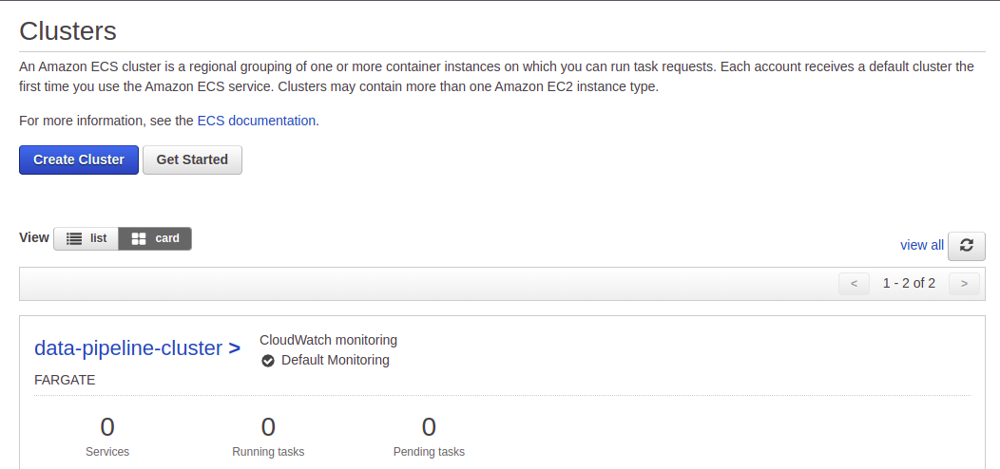

    Crear el cluster ECS y la task definition *dashboard-cluster* que despliega el servicio de Metabase. Reemplazar previamente en la task definition la variable de entorno `MB_DB_HOST` con el endpoint de la instancia RDS master
    
        $> aws ecs create-cluster --cluster-name dashboard-cluster --profile cde
        $> aws ecs register-task-definition --cli-input-json file://$PWD/dashboard-cluster.json --profile cde

Resumen de como quedó configurado el servicio

 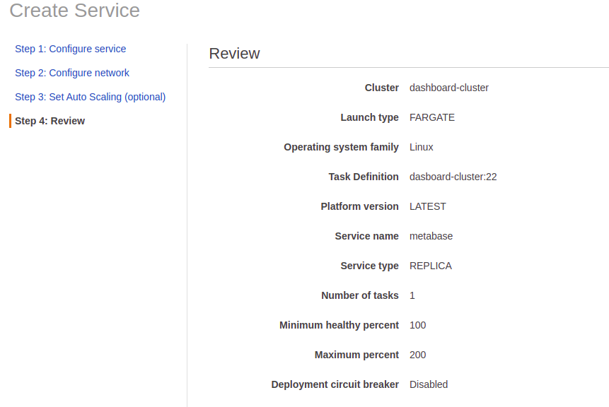

 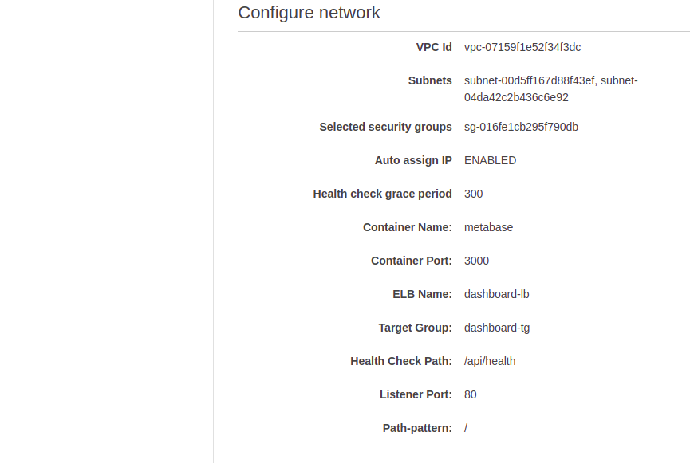

 

 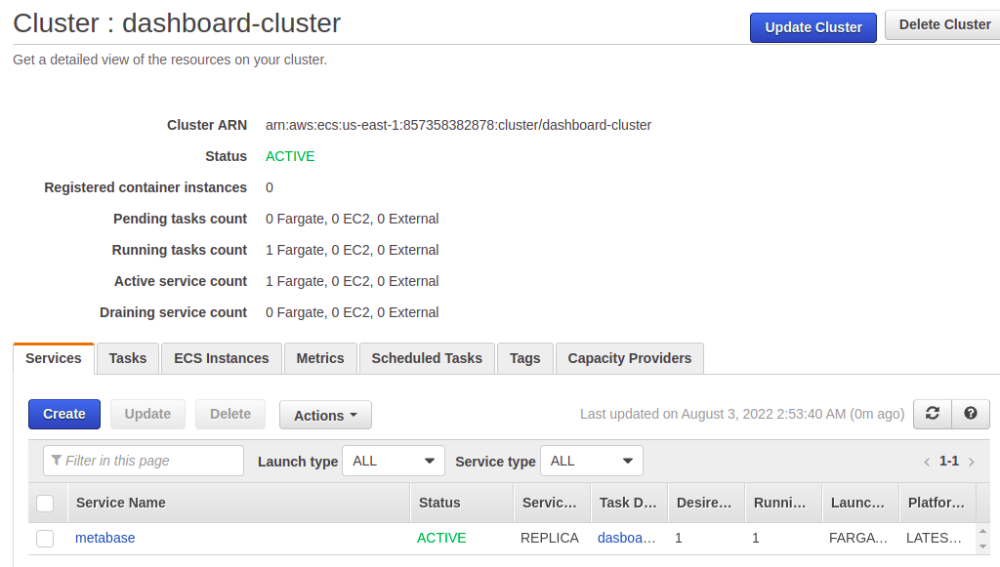

 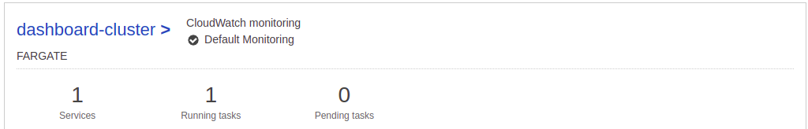

- En el repositorio GitHub del ETL, actualizar los secrets de GitHub Actions con las credenciales temporales otorgadas por el entorno de laboratorio. Luego hacer un deploy manual para forzar el building de la imagen docker del ETL y su registro en el repositorio *python-etl* de ECR.

  

- Finalmente crear un Aplication Load Balancer y un target group para soporte del despligue de Metabase a realizar con ECS fargate.

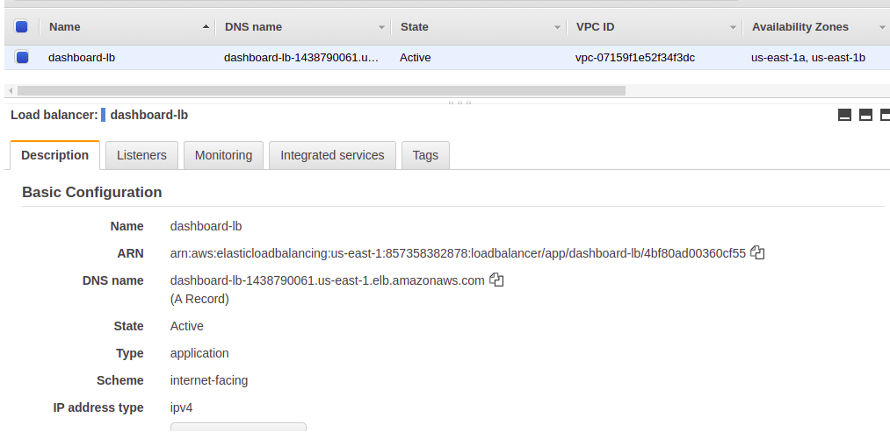 

 

El target group

 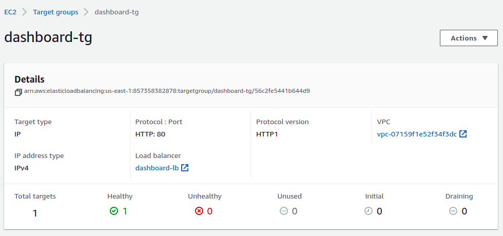 

 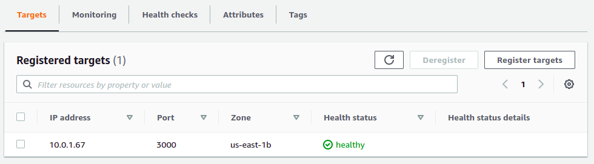

 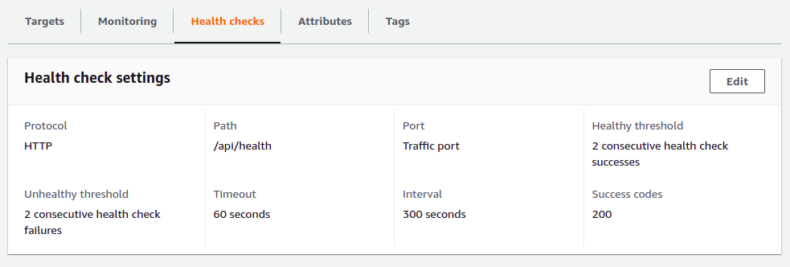

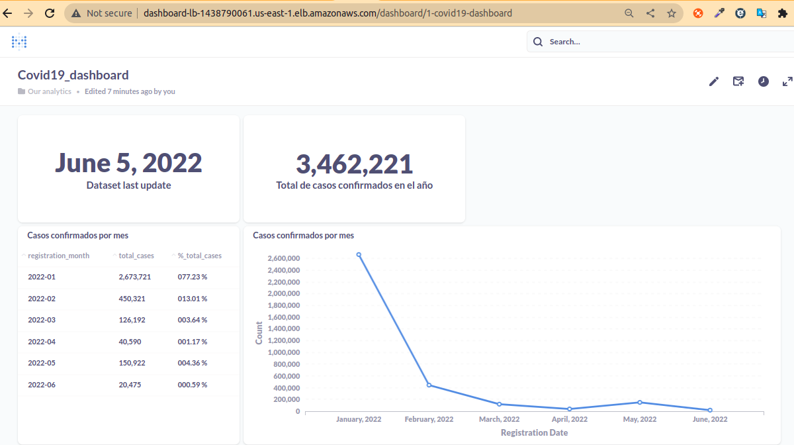

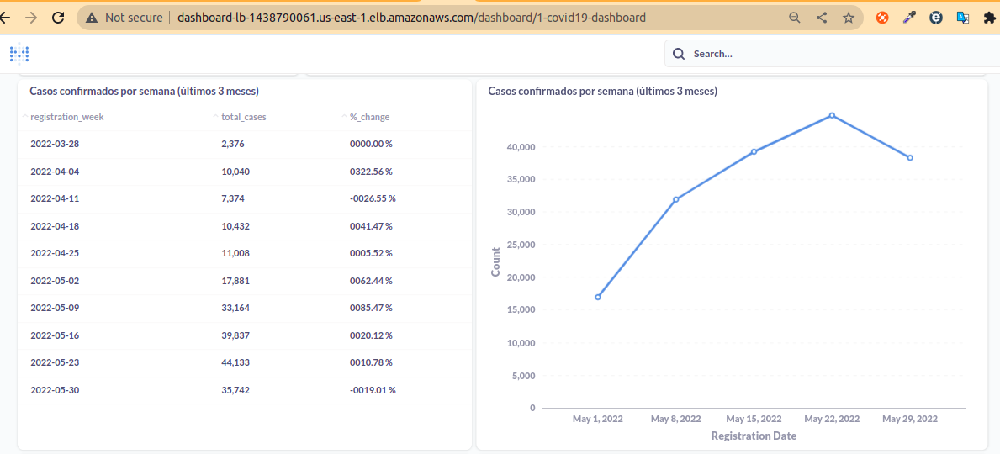

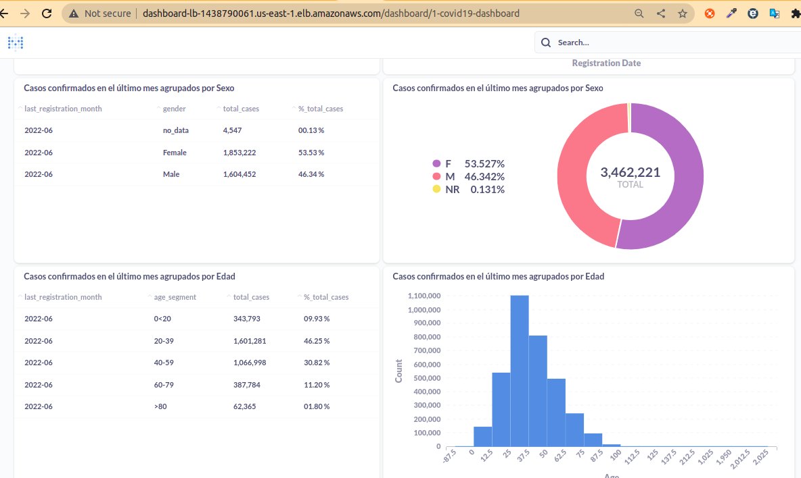

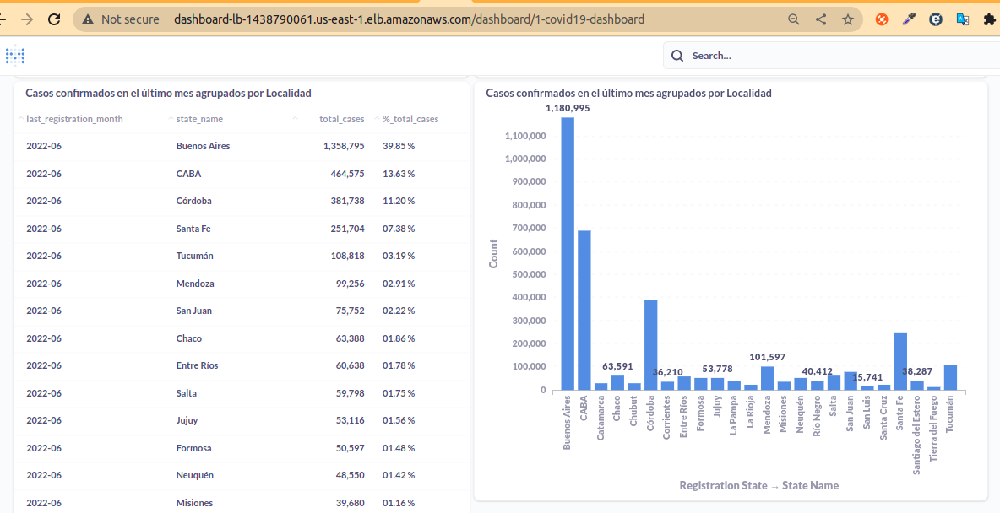

# HASTA ACA #
- Se implementan varios VPC Endpoints (los mínimos necesarios) para que la capa de aplicación pueda correr con éxito:
    - S3 endpoint para bajar/subir archivos de/a los buckets.
    - ECR-dkr y ECR-api para poder consultar/obtener desde el registro las imágenes de los contenedores.
    - Cloudwatch-logs para poder subir los logs de la corrida a Cloudwatch.

 

## Algunas imágenes

### S3
Buckets que se utilizan:

 

Bucket donde Labmda almacena los datasets tras la descarga:

 

Bucket donde se guarda el archivo con las variables de entorno (el archivo que se ve en la imagen no esta en este repositorio. Se omite con .gitignore para no exponer credenciales):

 

Bucket donde ECS Fargate guarda los reportes generados:

  

### Bastion Host
Acceso a base de datos desde equipo externo haciendo un Local Port Forwarding sobre ssh:

Nota: La IP Pública del bastión host hay que buscarla en la consola de AWS. Se puede resolver el inconveniente implementando un balancedor para el grupo de auto escalado ya que conserva siempre el mismo DNS name.

  

### Logs

Log de la última corrida de Lambda:

 

Log de la última corrida de la tarea de etl:

 

Log de la última corrida de la tarea de reporte:

