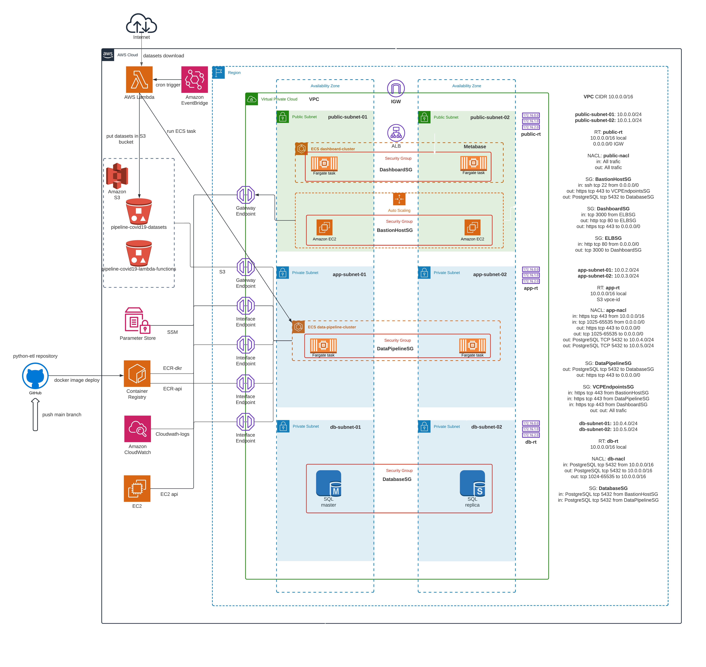

# Data pipeline Covid19 con AWS ECS Fargate
 

## Resumen

Data pipeline que extrae, procesa y analiza datos sobre casos de Covid19 reportados y publicados por el gobierno argentino en el sitio oficial https://datos.gob.ar/dataset/salud-covid-19-casos-registrados-republica-argentina. 

El data pipeline está organizado como una aplicación de alta disponibilidad en 3 capas - capa pública, capa de aplicación y capa de base de datos - que periódicamente extrae datos de una fuente pública, los transforma y los carga en un base PostgreSQL, dejando disponible un dashboard de análisis sobre Metabase que se utiliza como solución de reporting. 
Se implementa CI/CD con GitHub Actions para realizar el build y registro de la imágen docker del ETL en Elastic Container Registry (ECR), utilizada luego por el servicio de ECS fargate para ejecutar la tarea. 

Se utiliza Cloudformation para realizar gran parte del despliegue de la infraestructura. 
Se expone a continuación la topología de red utilizada.
    

  
 

## Descripción de la aplicación

Capa Pública: 

- **Bastion Host**: Se despliega un grupo de auto escalado con una sola instancias ec2 t2.micro utilizada como Bastion Host para poder gestionar la infraestructura. Esta solución permite conectar a la base de datos - sin acceso público - para realizar tareas de inicialización y mantenimiento. 

- **Matabase**: Se despliega el servicio de Metabase con un cluster ECS fargate, utilizando la RDS PostgreSQL del proyecto como backend, en lugar de la base H2 (default) que no se recomienda para ambientes productivos. El cluster ECS se implemta con Aplication Load Balancer. 

Capa de Aplicación:

- **ETL**: Se desliega otro cluster ECS fargate que ejecuta la tarea de ETL desarrollada en Python. El código del ETL está sobre un repositorio GitHub - https://github.com/jdanussi/data-pipeline-covid19-etl - conectado con el servicio de ECR por medio de GitHub Actions, que realiza el build y registro de la imagen docker cada vez que se "pushea" el main branch. 

Capa de Base de Datos:

- **PostgreSQL**: Se despliega una RDS PostgreSQL con una read replica Multi-AZ. La instancia de tipo *master* - lectura/escritura - es utilizada por el ETL para cargar los datos procesados, y por Metabase como backend de su operación. La instancia de tipo *replica* - solo lectura - es utilizada por Metabase para acceder a los datos y mostrar los dashboard previamente generados.
  

## Flujo de pa aplicación

- Periodicamente con un cron schedule se invoca una función **Lambda** desde **EventBridge** que hace el download de los datasets desde la ṕagina donde se publican y los almacena en un bucket **S3**. La periodicidad dependerá de la frecuencia de actualización de los dataset. 

- La función, luego de completar el download, corre una tarea de **ECS fargate** que transforma los datos de manera conveniente y los carga en tablas de la instancia RDS master de PostgreSQL. Tanto el cluster como la definición de la tarea ya existen en ECS, la función Lambda solo los invoca y setea algunos parámetros necesarios para la corrida. 

 

## Topología de red utilizada

- Se incluyen 2 zonas de disponibilidad para que la solución sea de alta disponibilidad.

- Se estructura la solución en 3 capas:
    - **Capa pública:** public-tier (sobre subnets públicas) 
        Bastion host sobre un grupo de auto escalado sin balanceador conpuesto por 1 sola instancia ec2 (Mínimo/Máximo/Deseado). El grupo de autoescalado esta seteado sobre 2 subnets / AZs.
    - **Capa de aplicación:** app-tier (sobre subnets privadas) 
        Cluster ECS Fargate sobre 2 subnets / AZs.
    - **Capa de base de datos:** db-tier (sobre subnets privadas) 
        RDS con la opción Multi-AZ habilitada.

- Se implementan varios VPC Endpoints (los mínimos necesarios) para que la capa de aplicación pueda correr con éxito:
    - S3 endpoint para bajar/subir archivos de/a los buckets.
    - ECR-dkr y ECR-api para poder consultar/obtener desde el registro las imágenes de los contenedores.
    - Cloudwatch-logs para poder subir los logs de la corrida a Cloudwatch.

 

## Algunas imágenes

### S3
Buckets que se utilizan:

 

Bucket donde Labmda almacena los datasets tras la descarga:

 

Bucket donde se guarda el archivo con las variables de entorno (el archivo que se ve en la imagen no esta en este repositorio. Se omite con .gitignore para no exponer credenciales):

 

Bucket donde ECS Fargate guarda los reportes generados:

  

### Bastion Host
Acceso a base de datos desde equipo externo haciendo un Local Port Forwarding sobre ssh:

Nota: La IP Pública del bastión host hay que buscarla en la consola de AWS. Se puede resolver el inconveniente implementando un balancedor para el grupo de auto escalado ya que conserva siempre el mismo DNS name.

  

### Logs

Log de la última corrida de Lambda:

 

Log de la última corrida de la tarea de etl:

 

Log de la última corrida de la tarea de reporte:

