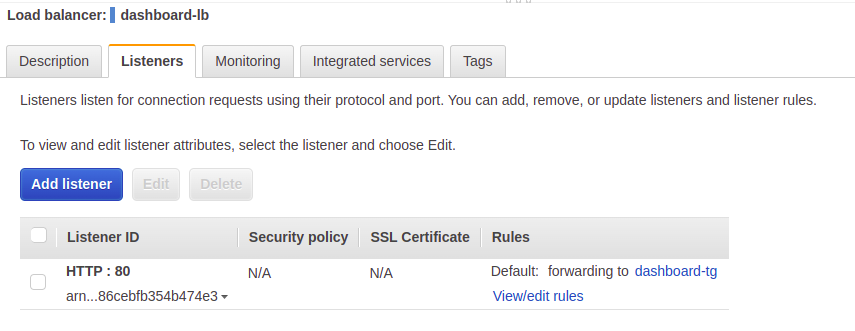

# Data pipeline Covid19 
 

## Resumen

Se desarrolló un data pipeline que extrae, procesa y analiza datos sobre casos de Covid19 publicados por el gobierno argentino en el sitio oficial https://datos.gob.ar/dataset/salud-covid-19-casos-registrados-republica-argentina. 

El data pipeline está organizado como una aplicación de alta disponibilidad en 3 capas - capa pública, capa de aplicación y capa de base de datos - que periódicamente extrae datos de una fuente pública, los transforma y los carga en un base PostgreSQL, disponibilizando un dashboard con análisis sobre *Metabase* que se utiliza como solución de reporting. 

Se implementa CI/CD con GitHub Actions para realizar el build de la imágen docker del ETL y el posterior registro en Elastic Container Registry (ECR), utilizada luego por el servicio de ECS fargate para ejecutar la tarea. 

Se utiliza Cloudformation para realizar gran parte del despliegue de la infraestructura. 

Se expone a continuación la arquitectura utilizada para la solución.
    

  
 

## Descripción de la aplicación

**Capa Pública**: 

- Bastion Host: Se despliega un grupo de autoescalado con una sola instancia ec2 de tipo t2.micro utilizada como Bastion Host para poder gestionar la infraestructura. Esta solución permite conectar a la base de datos - sin acceso público - para realizar tareas de inicialización y mantenimiento.  
Como será un servicio utilizado por pocas personas del área de IT, no se prevee autoescalado por demanda. Se configura un grupo de 1 sola instancia para asegurar alta disponibilidad. 
Para poder mapear siempre la misma EIP al servicio, se configura el launch template del grupo de autoescalado con el siguiente bootstrap script, incluído en el template de cloudformation que despliega este recurso:

            #!/bin/bash
            INSTANCE_ID=$(curl -s http://169.254.169.254/latest/meta-data/instance-id)
            MAXWAIT=3
            AWS_DEFAULT_REGION=$(curl -s http://169.254.169.254/latest/meta-data/placement/region)
            ALLOC_ID=`echo $(aws ssm get-parameter --name /cde/EIP --query Parameter.Value --region $AWS_DEFAULT_REGION) | tr -d '"'`
            echo Running: aws ec2 associate-address --region $AWS_DEFAULT_REGION --instance-id $INSTANCE_ID --allocation-id $ALLOC_ID --allow-reassociation
            aws ec2 associate-address --region $AWS_DEFAULT_REGION --instance-id $INSTANCE_ID --allocation-id $ALLOC_ID --allow-reassociation

- Matabase: Se despliega el servicio de Metabase con un cluster ECS fargate, utilizando la RDS PostgreSQL del proyecto como backend, en lugar de la base H2 (default) que no se recomienda para ambientes productivos. El cluster ECS fargate se implementa con Aplication Load Balancer. 

**Capa de Aplicación**:

- ETL: Se desliega otro cluster ECS fargate que ejecuta la tarea de ETL desarrollada en python. El código del ETL está sobre un repositorio GitHub - https://github.com/jdanussi/data-pipeline-covid19-etl - conectado con el servicio de ECR por medio de GitHub Actions, que realiza el build y registro de la imagen docker cada vez que se "pushea" el main branch. 

**Capa de Base de Datos**:

- PostgreSQL: Se despliega una RDS PostgreSQL con una read replica Multi-AZ. La instancia de tipo *master* - lectura/escritura - es utilizada por el ETL para cargar los datos procesados, y por Metabase como backend de su operación. La instancia de tipo *replica* - solo lectura - es utilizada por Metabase para acceder a la base `covid19` y generar los dashboard de análisis.
  

## Flujo de la aplicación

- Periodicamente una regla de cron en *EventBridge*, invoca la función *Lambda* encargada de hacer el download de los datasets en un bucket *S3*. La periodicidad dependerá de la frecuencia de actualización de los dataset. 

- La función, luego de completar el download, corre una tarea de *ECS fargate* que transforma los datos de manera conveniente y los carga en tablas de la instancia RDS master de PostgreSQL.  
La tarea de ETL no corre como un servicio dentro de ECS sino que es lanzada por la función lambda y la misma se termina una vez completado el proceso. 

- Un dashboard con análisis de los datos queda siempre disponible sobre Metabase, desplegado por un servicio de ECS fargate que corre de forma permanente. Se ideo así para que la capa de análisis y reporting quede disponible para cualquier otro proyecto de datos que se requiera en la VPC. 
A Metabase se accede mediante el nombre ṕublico DNS del Aplication Load Balancer que hace de frontend al grupo de auto escalado del servicio ECS fargate.  

 

## Despliegue de la infraestructura

Se despliega gran parte de la infraestructura utilizando AWS CLI con templates de Cloudformation.

A continuación se describe la secuencia de pasos a seguir dentro del ambiente de laboratorio otorgado por awsacademy.

- Actualizar credenciales AWS en el entorno local: Crear profile "cde" en `~/.aws/credentials` con las credenciales temporales otorgadas por el entorno de laboratorio.

      

 

- Agregar al IAM role *LabRole* la siguiente inline policy

        {
            "Version": "2012-10-17",
            "Statement": [
                {
                    "Effect": "Allow",
                    "Action": ["ssm:*"],
                    "Resource": ["*"]
                }
            ]
        }

    que permite full access al servicio de *System Manager Parameter Store* utilizado por la aplicación para la gestión de parámetros. 
     

     
     

- Crear el Key Pair *BastionHost* que se utilizará para acceso ssh al bastion host. 

    

  Hacer el download del archivo correspondiente y setear los permisos

        $> cd ~/.ssh
        $> mv ~/Downloads/BastionHost.pem .
        $> chmod 400 BastionHost.pem

- Parados en la carpeta root del proyecto, crear el stack *vpc-prod* utilizando el template `01-vpc.yml` 

        $> aws cloudformation create-stack \
            --stack-name vpc-prod \
            --template-body file://cfn-templates/01-vpc.yml \
            --profile cde

    El stack despliega y configura los siguientes recursos:
    - 1 VPC
    - 2 subnets públicas distribuídas en 2 zonas de disponibilidad para los servicios públicos (Public tier).
    - 2 subnets privadas distribuídas en 2 zonas de disponibilidad para alojar la corrida del ETL (Data pipeline tier).
    - 2 subnets privadas distribuídas en 2 zonas de disponibilidad para alojar la base de datos (Database tier).
    - 1 Internet Gateway para permitir el acceso a internet de las subnets públicas.
    - 3 tablas de rutas, una por cada capa. 
    - 6 VPC Endpoints.
    - 5 Security groups.
    - Personalización de los NACLs asociados a las subnets privadas para hacerlos más restrictivos.
      

    Los VPC Endpoints creados son:

    - S3 gateway endpoint: para descargar archivos de los buckets.
    - ECR-dkr y ECR-api: para que ECS pueda acceder al repositorio y descargar la imágene docker del ETL.
    - Cloudwatch-logs: para que ECS pueda registrar los logs de la corrida del ETL y del servicio de Metabase.
    - SSM: para que ECS pueda acceder a los parámetros almacenados en Parameter Store.
    - EC2-api: para que el despliegue de instancias ec2 del grupo de autoescalado del bastion host, puedan ser configuradas siempre con la misma IP Pública (EIP).
          

- Registrar en System Manager Parameter Store los siguiente parámetros iniciales

    - /cde/POSTGRES_USER
    - /cde/POSTGRES_PASSWORD 
    - /cde/DB_DATABASE 
    - /cde/DB_USER 
    - /cde/DB_PASS 
    - /cde/S3_BUCKET_DATASETS 
    - /cde/S3_BUCKET_REPORT 
    - /cde/S3_BUCKET_LAMBDA 
    - /cde/ECS_CLUSTER 
    - /cde/ECS_TASK_DEFINITION 
      

    utilizando el script de bash `parameter_store_values_put.sh` que se encuentra en la carpeta root del proyecto: 

        $> bash parameter_store_values_put.sh
   
    El script ejecuta las sentencias siguientes:

        #!/usr/bin/env bash

        aws ssm put-parameter \
        --name /cde/POSTGRES_USER \
        --type String \
        --value "postgres" \
        --description "Master Username for database" \
        --overwrite \
        --profile cde

        aws ssm put-parameter \
        --name /cde/POSTGRES_PASSWORD \
        --type SecureString \
        --value "postgres123" \
        --description "Master Password for database" \
        --overwrite \
        --profile cde
        
        aws ssm put-parameter \
        --name /cde/DB_DATABASE \
        --type String \
        --value "covid19" \
        --description "Database to use" \
        --overwrite \
        --profile cde

        aws ssm put-parameter \
        --name /cde/DB_USER \
        --type String \
        --value "covid19_user" \
        --description "Database user" \
        --overwrite \
        --profile cde

        aws ssm put-parameter \
        --name /cde/DB_PASS \
        --type SecureString \
        --value "covid19_pass" \
        --description "Database password" \
        --overwrite \
        --profile cde

        aws ssm put-parameter \
        --name /cde/S3_BUCKET_DATASETS \
        --type String \
        --value "pipeline-covid19-datasets" \
        --description "S3 bucket to store datasets download from internet" \
        --overwrite \
        --profile cde

        aws ssm put-parameter \
        --name /cde/S3_BUCKET_REPORT \
        --type String \
        --value "pipeline-covid19-reports" \
        --description "S3 bucket to store data pipeline reports" \
        --overwrite \
        --profile cde

        aws ssm put-parameter \
        --name /cde/S3_BUCKET_LAMBDA \
        --type String \
        --value "pipeline-covid19-lambda-functions" \
        --description "S3 bucket Bucket to store the lambda function that runs the ECS task" \
        --overwrite \
        --profile cde

        aws ssm put-parameter \
        --name /cde/ECS_CLUSTER \
        --type String \
        --value "data-pipeline-cluster" \
        --description "ECS Fargate Cluster" \
        --overwrite \
        --profile cde

        aws ssm put-parameter \
        --name /cde/ECS_TASK_DEFINITION \
        --type String \
        --value "data-pipeline-cluster" \
        --description "ECS Task Definition" \
        --overwrite \
        --profile cde

    Se muestran algunos de los parámetros creados desde la consola

    

   
- Crear el stack *asg-prod* que despliega un grupo de auto escalado en la capa pública para el Bastion Host, utilizando el template `02-asg.yml`

        $> aws cloudformation create-stack \
            --stack-name asg-prod \
            --template-body file://cfn-templates/02-asg.yml \
            --profile cde

    Este template incluye en la definición del launch template, el bootstrap script que asigna la unica EIP de la VPC a la instancia ec2 que se lanza.

- Crear el stack *rds-prod* que despliega las instancias RDS master y replica en la capa de base de datos utilizando el template `03-rds.yml`

        $> aws cloudformation create-stack \
            --stack-name rds-prod \
            --template-body file://cfn-templates/03-rds.yml \
            --profile cde

    El template registra en Parameter Store los endpoints de ambas instancias.

    

    

- Crear el stack *s3-prod* que despliega los buckets S3 para almacenar los datasets fuente y la distribución de la función lambda que se creará más adelante. Se utiliza el template `04-s3.yml`

        $> aws cloudformation create-stack \
            --stack-name s3-prod \
            --template-body file://cfn-templates/04-s3.yml \
            --profile cde

    

- Crear el stack *ecr-prod* que despliega en ECR el repositorio *python-etl* que alojará la imagen docker del ETL. Se utiliza el template `05-ecr.yml`

        $> aws cloudformation create-stack \
            --stack-name ecr-prod \
            --template-body file://cfn-templates/05-ecr.yml \
            --profile cde

    

- Subir a S3 el archivo .zip necesario para el deploy de la función lambda

        $> cd downloadFileToS3
        $> aws s3api put-object --bucket pipeline-covid19-lambda-functions --key downloadFileToS3 --profile cde --body ./lambda_function.zip

- Crear el stack *lambda-prod* que despliega la función lambda encargada de hacer el download de los datasets desde las fuentes, y de ejecutar la tarea ETL sobre el servicio ECS fargate. Se utiliza el template `06-lambda.yml`

        $> aws cloudformation create-stack \
            --stack-name lambda-prod \
            --template-body file://cfn-templates/06-lambda.yml \
            --capabilities CAPABILITY_NAMED_IAM \
            --capabilities CAPABILITY_AUTO_EXPAND \
            --profile cde

    Este stack crea además el grupo de log correspondiente en Cloudwatch.

- Crear el stack *logs-prod* que despliega los grupos de log en Cloudwatch para las tareas ECS. Se utiliza el template `07-logs.yml`

        $> aws cloudformation create-stack \
            --stack-name LOGS01 \
            --template-body file://cfn-templates/07-logs.template.yaml \
            --profile cde

    

- Inicializar la base de datos utizando el bastion host para acceder. Para ello agregamos la Elastic Public IP (EIP) del Bastion Host en `/etc/hosts`. Ejemplo

        54.225.211.158 bastionlab

    Hacemos el ssh forwarding para que toda conexión al puerto 4000 del equipo local sea dirigida al master RDS endpoint a travez del bastion host  

        $> ssh -N -L 4000:database-master.c5ky66tbevcc.us-east-1.rds.amazonaws.com:5432 ec2-user@bastionlab -i ~/.ssh/BastionHost.pem -v

    Como las instancias ec2 que integran el grupo de autoescalado de bastion host pueden variar - Ej: cada vez que se inicia una nueva sesión de laboratio - , va a ser necesario ejecutar lo siguiente para quitar el viejo registro en el archivo de `known_hosts`

        $> ssh-keygen -f "/home/jorge/.ssh/known_hosts" -R "bastionlab"

    Crear las tablas necesarias en la base *covid19* utilizando el script de python `python-scripts\db_init.py`

        $> cd python-scripts
        $> python3 ./db_init.py
        Connection to database created
        Database info: ('PostgreSQL 13.4 on x86_64-pc-linux-gnu, compiled by gcc (GCC) 7.3.1 20180712 (Red Hat 7.3.1-12), 64-bit',)
        Pagila SQL scripts executed
        Number of database tables: 3
        Database connection closed

    Los detalles de este script pueden verse en el repositorio del proyecto.

    Crear la base de datos para soporte de Metabase

        $> psql -h localhost -p 4000 -v ON_ERROR_STOP=1 -U postgres<<-EOSQL
        CREATE DATABASE metabase WITH ENCODING = 'UTF8';
        EOSQL

    Crear el cluster ECS y la task definition *data-pipeline-cluster*

        $> aws ecs create-cluster --cluster-name data-pipeline-cluster --profile cde
        $> aws ecs register-task-definition --cli-input-json file://$PWD/data-pipeline-cluster.json --profile cde

    

    Crear el cluster ECS y la task definition *dashboard-cluster* que despliega el servicio de Metabase. Reemplazar previamente en la task definition la variable de entorno `MB_DB_HOST` con el endpoint de la instancia RDS master
    

        $> aws ecs create-cluster --cluster-name dashboard-cluster --profile cde
        $> aws ecs register-task-definition --cli-input-json file://$PWD/dashboard-cluster.json --profile cde

- En el repositorio GitHub del ETL, actualizar los secrets de GitHub Actions con las credenciales temporales otorgadas por el entorno de laboratorio. Luego hacer un deploy manual para forzar el building de la imagen docker del ETL y su registro en el repositorio *python-etl* de ECR.

     

    Se muestra el último deploy exitoso

    

- Finalmente crear un Aplication Load Balancer y un target group para soporte del despligue de Metabase a realizar con ECS fargate.

     

     

    El target group

     

    

    

- Habiendo creado el ELB y el target group, continuar con la creación del servicio fargate  correspondiente 

  

  

  

  

  

  tasks definition de los clusters creados

  

- Se muestra el despliegue exitoso de algunos stacks de Cloudformation

    

- Crear en *EventBridge* un cron schedule semanal - el dataset de casos covid19 se actualiza todos los domingos - que ejecute la función lambda encarga del download de los datasets y de lanzar la tarea de ETL.

        $> aws events put-rule --schedule-expression "cron(00 00 ? * 2 2022-2023)" --name Covid19 --profile cde
        {
            "RuleArn": "arn:aws:events:us-east-1:857358382878:rule/Covid19"
        }
        jorge:tp1-data-pipeline-covid19$ aws events put-rule --schedule-expression "cron(00 00 ? * 2 2022-2023)" --name Covid19 --description "Run Covid19 Lambda function" --profile cde
        {
            "RuleArn": "arn:aws:events:us-east-1:857358382878:rule/Covid19"
        }
        jorge:tp1-data-pipeline-covid19$ 

    

    

 

## Ejecución de la aplicación

### Logs generados 
 

Lamba function

Tarea ETL

Servicio de Metabase

 

### S3
Bucket donde se guardan los datasets descargados

 

### Dashboard en Metabase

Metabase utiliza la RDS master de Postgres como backend, donde guarda todas las configuraciones, cuentas de usuario,  análisis y dashborad creados.

Pero una vez creados los dashboards, conviene conectar Metabase a la RDS réplica, para quitar carga de trabajo sobre la instancia master que se ocupa principalmente de los accesos de escritura del ETL. 
Se muestra a continuación como quedó la configuración de acceso a la base de datos ***covid19***

 

Dashboard creado con las mismas queries utilizadas en el proyecto inicial pero incorporando gráficos

 

# Costo de la solución

A continuación se muestra un cálculo aproximado de [costos](https://calculator.aws/#/estimate?id=31a63b929bf6356a7bd6028101c55e6f32b8de48) para esta solución

